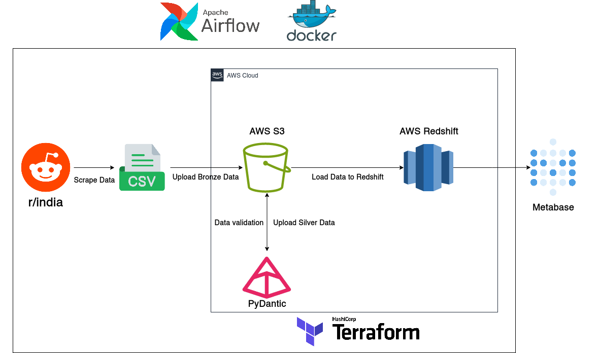
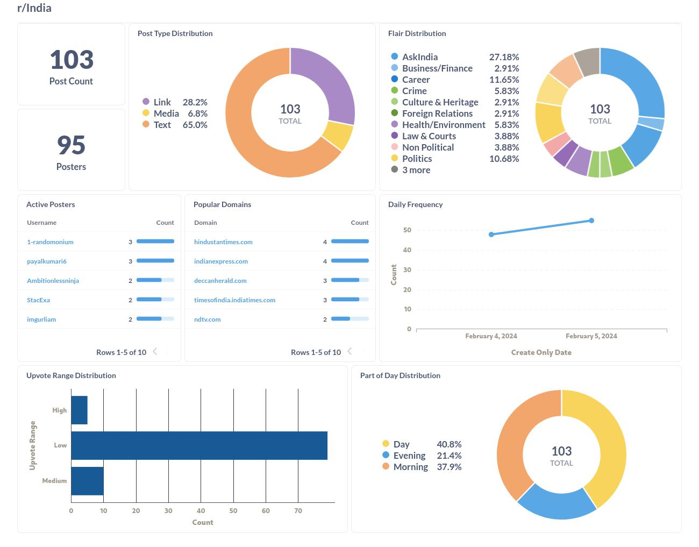

# Reddit India Pipeline
Pipeline that scrapes data from [r/india](https://old.reddit.com/r/india) subreddit and finalizes data for the visual layer.

## Architecture

- **Infra Provisioning:** Terraform (with AWS)
- **Containerization:** Docker
- **Orchestration:** Airflow
- **Visual Layer:** Metabase

### DAG Tasks:
1. Scrape data from r/india to generate bronze data
2. Validate using Pydantic and load data to S3
3. Generate and valiate silver data and load to S3
4. Load silver data into Redshift

## Requirements
1. AWS CLI and Terraform for infra provisioning
2. Docker for Airflow and DAG execution

## Setup
Setup and intial execution is handled by the Makefile.
1. `make init`: Intializes Airflow (User setup, DB migrations)
2. `make infra`: Sets up the AWS Infrastructure (S3, Redshift, Budget) and creates the `configuration.env` file with the secrets
3. `make up`: Runs Airflow

## Dashboard

